# Stage 1 Gameplay Reverse Engineering — اجمعوا الكنوز

> **Document type:** Old ZIP vs current Next.js vs official rules (no code changes)  
> **Date:** 2026-06-03  
> **Old reference:** `sufaraa-v9-6-75-contestant-gameflow-router-fix (1).zip` → extracted `_sufaraa_old_ref`  
> **Current app:** `codex-master-prompt-v1-sufaraa-al`  
> **Official rules:** `Sufaraa-Al-Maseeh-Master-Documentation-v1.pdf` §8 (summarized in `docs/project-master-context.md` §10.2)

---

## 1. Stage identity and scope

| Item | Official (PDF §8) | Old project (v9.6.75) | Current project (Frozen v1) |
|------|-------------------|------------------------|-----------------------------|
| Arabic name | **اجمعوا الكنوز** | Same | Same |
| Concept | Fast treasure-hunt trivia; sequential questions | Same | Same |
| Question count | Up to **50** | **50** (`DATA.stage1`, `getStage1Plan`) | **6** mocks only |
| Stage timer | **7 minutes** (420 s) | Default **07:00** on `#timer1`; synced with `gameFlow` | Facilitator **Start Stage 1 Timer** → 420 s |
| Scoring | **+5** correct, **0** wrong (max 250) | +5 / 0 | +5 / 0 (transaction) |
| Who advances stage | Facilitator / admin | `gameFlow.status` + admin `startGameStageV960` | Facilitator `gameFlow` buttons |
| Team sees correct/wrong during play | No | No | No |

### Type name mapping (old ↔ current)

| Old Arabic label | Old engine key | Current `Stage1QuestionType` | Notes |
|------------------|----------------|------------------------------|-------|
| اختر من متعدد | `اختر من متعدد` | `multiple_choice` | Aligns when options ≥ 2 |
| ماذا ينقص | `ماذا ينقص` | `missing` (misnamed) | Old = **typed** answer; current = **MC** |
| فراغات | `فراغات` | *(no type)* | Old = **typed**; official expects dedicated blanks bank |
| رتّب | `رتّب` | `arrange` | Old = **4-tap order**; current = **single MC pick** |

---

## 2. End-to-end flow (all roles)

```mermaid
flowchart TB
  subgraph official [Official PDF §8]
    O1[Facilitator: intro] --> O2[Running + 7 min timer]
    O2 --> O3[Up to 50 sequential Qs]
    O3 --> O4[Facilitator ends stage]
  end

  subgraph old [Old v9.6.62+]
    A1[intro1 + video] --> A2[stage1 page]
    A2 --> A3[showQ1 loop 0..49]
    A3 --> A4{Q50 answered?}
    A4 -->|yes| A5[Instant moderatorWaitV960]
    A4 -->|no| A3
    A5 --> A6[Firestore changeScore async]
    A6 --> A7[Facilitator advances gameFlow]
  end

  subgraph current [Current Frozen v1]
    C1[stage1_intro placeholder] --> C2[stage1_running]
    C2 --> C3[Local mock index 0..5]
    C3 --> C4[confirmStage1Answer + 850ms]
    C4 --> C5{More mocks?}
    C5 -->|yes| C3
    C5 -->|no| C6[Empty state still stage1_running]
    C7[Facilitator stage1_finished] --> C8[أحسنتم team screen]
  end
```

---

## 3. Screens by role

### 3.1 Old project (contestant `index.html`)

| Screen / page ID | When shown | Key DOM / files |
|------------------|------------|-----------------|
| `intro1` | Before stage; video + “7 دقائق” | `index.html` L132–145 |
| `stage1` | While `team.current === 'stage1'` and flow running | `#stage1Type`, `#count1`, `#timer1`, `#q1`, `#a1`, `#progress1` |
| `moderatorWaitV960` | After Q50 or stage ended / flow `finished` | Injected by `contestant-game-flow.js`; title “أحسنتم! …” |
| `intro2` | **Not** auto after Q50 (blocked in v9.6.61+) | Would be next stage intro |

**Screenshot / UI references (old):** No PNG assets in the ZIP; reconstruct from:

- `index.html` — stage shell markup  
- `contest-fixes-v9542.js` — `.stage1-arrange-v9542`, `.stage1-choice-confirm-v95118`  
- `script.js` — `.stage1-clean-box`, `.stage1-clean-arrange-option`  
- Reports: `STAGE1_FINAL_INSTANT_WAIT_V9662_REPORT.md`, `STAGE1_FINAL_FLOW_FIX_V9661_REPORT.md`

### 3.2 Current project

| `gameFlow.status` | Team `/team` | Audience `/audience` | Facilitator `/facilitator` |
|-------------------|--------------|----------------------|----------------------------|
| `stage1_intro` | `GameFlowPlaceholder` | Placeholder | Flow: “شرح المرحلة الأولى” |
| `stage1_running` | `Stage1RunningScreen` | `AudienceStage1Running` (timer + ranking) | Timer start + `Stage1RankingTable` + registered teams |
| `stage1_finished` | `Stage1TeamFinishedScreen` | `AudienceStage1Finished` | “إنهاء المرحلة الأولى” + ranking |

**Source files:** `features/team/components/team-shell.tsx`, `features/audience/components/audience-shell.tsx`, `features/facilitator/components/facilitator-shell.tsx`

---

## 4. Question types (detailed)

Each subsection follows: **old → current → missing → wrong → screens → player steps → scoring → timing**.

---

### 4.1 اختر من متعدد (Multiple choice)

#### 1) Old project

- **Detection:** `normalizeType` → `اختر من متعدد`; `s1IsChoice()` true when type is MC or `options.length >= 2`.
- **UI:** 2+ option buttons + disabled **تأكيد الإجابة** until one selected (`contest-fixes-v9542.js` `renderQuestion` / `bindQuestion`; also `script.js` `s1RenderChoice`).
- **Data:** `data.js` — each row `[q, answer, opt1, opt2, opt3]` → `{ q, answer, options }`.
- **Advance:** `answerStage1` → `showQ1()` immediately (non-final); score via `changeScore`.

**Old source files:** `contest-fixes-v9542.js` L52–120, `script.js` L2247–2335, `data.js` L2–53

#### 2) Current project

- **Type:** `multiple_choice` in `stage1-mock-questions.ts` (2 samples).
- **UI:** `Stage1QuestionCard` — grid of buttons, one selection, **تأكيد الإجابة** (`stage1-question-card.tsx`).
- **Confirm:** `confirmStage1Answer` — exact string match `answer === question.correctAnswer`.

#### 3) Missing (vs old + official)

- 44+ real bank questions (only 2 MC mocks).
- Excel/Firestore question import.
- Arabic text normalization on compare (old uses `normalizeText` / `norm`).
- Per-question type badge on team UI (old: `#stage1Type`).

#### 4) Wrong

- None critical for pure MC when options exist; matching is stricter than old (no diacritic folding).

#### 5) Screens

| Role | Old | Current |
|------|-----|---------|
| Team | `#stage1` / `#a1` | `Stage1RunningScreen` + `Stage1QuestionCard` |
| Audience | Ranking + timer (audience script) | `AudienceStage1Running` |
| Facilitator | Admin flow + team table | `FacilitatorShell` ranking tab |

#### 6) Player steps (team)

| Step | Old | Current |
|------|-----|---------|
| 1 | See `سؤال N من 50` and type badge | See `السؤال N من 6` |
| 2 | Tap one option (highlight) | Tap one option |
| 3 | Tap **تأكيد الإجابة** | Tap **تأكيد الإجابة** |
| 4 | Inputs disabled; next question | “تم تأكيد الإجابة”; auto-advance ~850 ms |
| 5 | (Q50) → wait screen | (Q6) → empty state, not wait |

#### 7) Scoring

| | Old | Current |
|---|-----|---------|
| Correct | +5 | +5 (`CORRECT_ANSWER_POINTS`) |
| Wrong | 0 | 0 |
| Duplicate | Client busy flags; server via team progress | Firestore transaction + `duplicate: true` |
| Progress | `progress.stage1.i` | `progress.stage1QuestionIndex` (+1 on confirm) |

#### 8) Timing

| | Old | Current |
|---|-----|---------|
| Per-question | Immediate `showQ1()` after save (non-final) | **850 ms** `setTimeout` after confirm |
| Stage | Local 1 s interval + `gameFlow` sync | Central timer; blocks confirm when expired |
| Final question | **Instant** wait (see §5) | Same 850 ms; no instant wait |

---

### 4.2 ماذا ينقص (What is missing — typed)

#### 1) Old project

- **Detection:** Type `ماذا ينقص`, or MC with **&lt; 2 options** reclassified in `showQ1` (`contest-fixes-v9542.js` L205).
- **UI:** Text input, placeholder **اكتب الشيء الناقص هنا** (`script.js` L2338–2348).
- **Grading:** `normalizeText(answer) === normalizeText(q.answer)` (diacritics/alef/ya normalized).
- **Plan slot:** `STAGE1_TYPES[0]` — rotates in plan but bank order is fixed Excel index (`buildStage1Plan`).

**Old source files:** `script.js` L342, L2338–2381, `contest-fixes-v9542.js` L14–22, L64–65, L182–187

#### 2) Current project

- **Type:** `missing` — implemented as **multiple choice** (4 options), not text.
- **Samples:** `stage1-missing-1`, `stage1-missing-2` in `stage1-mock-questions.ts`.
- **Grading:** Exact match to `correctAnswer` string (no normalization).

#### 3) Missing

- Dedicated **text input** UX and placeholder.
- Reclassification rule (MC without options → missing).
- Normalized Arabic compare.
- Official “missing word” bank at scale.

#### 4) Wrong

- **Type name `missing` implies gap-fill typing; UI is MC** — gameplay mismatch with old and PDF intent.
- Cannot accept alternate spellings accepted by old `norm()`.

#### 5) Screens

Same as §4.1 team card; old used `#stage1Input` inside `#a1`.

#### 6) Player steps

| Step | Old | Current |
|------|-----|---------|
| 1 | Badge **ماذا ينقص** | Same card layout as MC (no type label) |
| 2 | Type in input | Pick one of four buttons |
| 3 | **تسجيل الإجابة** / confirm | **تأكيد الإجابة** |
| 4 | Next question | 850 ms → next |

#### 7) Scoring

+5 / 0 same as MC; wrong answers still advance index (both).

#### 8) Timing

Same stage timer; no per-question timer in either build.

---

### 4.3 فراغات (Fill in the blanks — typed)

#### 1) Old project

- **Detection:** `normalizeType` → `فراغات` (also “أكمل”, “fill”, “blank”).
- **UI:** Same text card as generic input; placeholder **اكتب الإجابة هنا** (`script.js` L2338–2348).
- **Data:** Last rows in `data.js` e.g. “أكمل: الرب راعي فلا ____ …” with answer `يعوزني`.
- **Grading:** Normalized text vs `q.answer`.

**Old source files:** `script.js` L342, L1428–1431, `data.js` L50–52

#### 2) Current project

- **No `فراغات` type** in `stage1-types.ts`.
- Partial overlap: mock prompts say “أكمل الآية” but use type `missing` + MC options.

#### 3) Missing

- Entire question type and typed blank UI.
- Official note: dedicated **أكمل الفراغات** bank (`project-master-context.md` §10.2).

#### 4) Wrong

- Labeling “أكمل” questions as `missing` MC teaches wrong interaction (pick word vs type word).

#### 5) Screens

Old: `#stage1` + input card. Current: same MC card as §4.2.

#### 6) Player steps

| Step | Old | Current |
|------|-----|---------|
| 1 | See complete-the-blank prompt | See “أكمل…” prompt |
| 2 | Type answer | Select one option |
| 3 | Confirm | Confirm |
| 4 | Next | Next (850 ms) |

#### 7) Scoring

+5 / 0 when normalized text matches (old); +5 / 0 on exact option string (current).

#### 8) Timing

Identical to §4.2.

---

### 4.4 رتّب (Arrange — tap order, 4 parts)

#### 1) Old project

- **Detection:** `normalizeType` → `رتّب`.
- **UI:** Four shuffled buttons (`seededShuffle`); tap to build order (toggle remove/repick); chips show 1–4; **تأكيد الترتيب** enabled at 4 picks (`contest-fixes-v9542.js` L122–178; `script.js` L2352–2372).
- **Submit payload:** `picked.join(' | ')` (pipe-separated).
- **Correct:** `arrangeCorrectParts(q).join(' | ')` from `answer`, `correctOrder`, or `options`.
- **Grading:** `normalizeText(submitted) === normalizeText(expected)`.

**Old source files:** `contest-fixes-v9542.js` L26–48, L122–178, L220–227; `contestant-ui-polish-v9654.js` L131–136

#### 2) Current project

- **Type:** `arrange` with `parts: string[]`.
- **UI:** `Stage1QuestionCard` lists `parts` as **numbered buttons**; player selects **one** string (`selectedAnswer === answer`).
- **Correct:** `correctAnswer` set to **first word only** (e.g. `"مصباح"`) in mocks — not full order.
- **Grading:** Single string equality — **cannot represent a permutation**.

#### 3) Missing

- Multi-tap ordering UI and picked-order display.
- Shuffle per team/question seed.
- Reset (**إعادة الترتيب**) control.
- Pipe-joined answer format in Firestore.
- `correctOrder` / 4-part validation.

#### 4) Wrong

- **Arrange is implemented as single-choice MC** — structurally incorrect.
- **`correctAnswer` is one fragment**, so even a proper order UI would need schema change.
- Selecting “مصباح” alone cannot mean “مصباح | لرجلي | كلامك | ونور | لسبيلي”.

#### 5) Screens

Old: `#q1.stage1-arrange-question`, `.stage1-arrange-v9542` grid. Current: same 2-column button grid as MC with numeric prefixes.

#### 6) Player steps

| Step | Old | Current |
|------|-----|---------|
| 1 | See prompt + 4 shuffled words | See prompt + 5 labeled parts |
| 2 | Tap words in order (1→4) | Tap **one** part |
| 3 | Optional reset | — |
| 4 | **تأكيد الترتيب** | **تأكيد الإجابة** |
| 5 | Submit `a \| b \| c \| d` | Submit single word |
| 6 | Next question | Next question |

#### 7) Scoring

| | Old | Current |
|---|-----|---------|
| Full order correct | +5 | N/A (only first word can match) |
| Wrong order | 0 | Usually 0 unless lucky first-word pick |
| Partial | 0 | — |

#### 8) Timing

Same as other types; on Q50 old still instant-waits before Firestore completes.

---

## 5. Cross-cutting behaviors

### 5.1 Scoring (all types)

| Rule | Official | Old | Current |
|------|----------|-----|---------|
| Points per correct | +5 | +5 | +5 |
| Wrong answer | 0 | 0 | 0 |
| Max theoretical | 250 | 250 | 30 (6 mocks) |
| Duplicate answer | — | Client guards | Transaction returns existing `pointsDelta` |
| Show result to team | No | No | No |
| Answer doc path | — | Team logs | `competitions/main/answers/stage1_{questionId}_{teamId}` |

### 5.2 Timing (all types)

| Mechanism | Old | Current |
|-----------|-----|---------|
| Stage duration | 420 s default; `stage1Runtime` 1 s tick | `timer.durationSeconds = 420`, facilitator-started |
| Timer display | `#timer1` MM:SS, danger ≤30 s | `TimerCountdown` |
| Timer → end stage | `remaining<=0` → `finishStage('stage1','intro2')` | Expiry blocks answers; facilitator must set `stage1_finished` |
| Per-question delay | ~0 ms (show next immediately) | **850 ms** after every confirm |
| Last question | **Instant** `moderatorWaitV960` + `renderWaiting('finished',1)` **before** `changeScore` completes | Same 850 ms; then “انتهت الأسئلة التجريبية…” while still `stage1_running` |
| Progress sync | `progress.stage1.i` + local `stage1LocalI` max(remote, local) | Firestore `stage1QuestionIndex` updated; **UI index starts at 0 on refresh** |

**Old instant-wait evidence:** `contestant-ui-polish-v9654.js` L142–174; `STAGE1_FINAL_INSTANT_WAIT_V9662_REPORT.md`

### 5.3 Question index and bank

| | Old | Current |
|---|-----|---------|
| Count | `min(50, DATA.stage1.length)` | `stage1MockQuestions.length` (= 6) |
| Order | Fixed Excel order in `buildStage1Plan` | Array order in mock file |
| Index authority | `team.progress.stage1.i` + anti-rollback | Local `useState(0)` + Firestore index on confirm only |
| End condition | `i >= total` → wait | Local `questionIndex >= length` → empty state |

### 5.4 Facilitator vs contestant “ready”

| | Old | Current |
|---|-----|---------|
| Start stage | Admin `startGameStageV960(1)` after all teams “ready” on intro | Facilitator button only; `readiness.stage1` not wired |
| End stage | Facilitator flow status | `finishStage1()` → `stage1_finished` |

---

## 6. Official rules checklist (PDF §8)

From `docs/project-master-context.md` §10.2 and `docs/stage3-architecture-proposal.md` §2.1:

| Rule | Current match |
|------|----------------|
| Name اجمعوا الكنوز | ✅ |
| 7-minute timer | ✅ |
| +5 / 0 scoring | ✅ |
| Sequential auto-advance after confirm | ✅ (850 ms) |
| No correct/wrong shown during play | ✅ |
| Audience: stage score + timer (no total column) | ✅ |
| Facilitator: stage + total + question index | ✅ |
| Up to **50** questions | ❌ (6 mocks) |
| Question types: missing / MC / arrange / blanks | ❌ (partial; arrange broken; no فراغات) |
| Max 50 enforced as end condition | ❌ (facilitator-driven) |
| Last-answer team wait before facilitator end | ❌ (old behavior; not in current) |

---

## 7. Old project file index (Stage 1)

| File | Role |
|------|------|
| `index.html` | Contestant pages `intro1`, `stage1`, DOM ids |
| `data.js` | 50-question bank (MC rows + 2 fill samples) |
| `script.js` | `render1`, timer, `STAGE1_TYPES`, `buildStage1Plan`, clean UI `s1Render*` |
| `contest-fixes-v9542.js` | Primary Stage 1 render/bind/answer (`showQ1`, `answerStage1`, arrange v9542) |
| `contestant-ui-polish-v9654.js` | Q50 instant wait override for `answerStage1` |
| `contestant-game-flow.js` | `gameFlow` routing, `moderatorWaitV960`, `renderWaiting` |
| `admin-game-flow.js` | Facilitator start stage, durations, `stageStartProgress` |
| `STAGE1_FINAL_INSTANT_WAIT_V9662_REPORT.md` | Verified Q50 wait behavior |
| `STAGE1_FINAL_FLOW_FIX_V9661_REPORT.md` | No blessing overlay; moderator wait only |

**ZIP path:** `c:\Users\ASUS\Downloads\_sufaraa_old_ref\`

---

## 8. Current project file index (Stage 1)

| File | Role |
|------|------|
| `features/stage1/stage1-types.ts` | `missing` \| `multiple_choice` \| `arrange` |
| `features/stage1/stage1-mock-questions.ts` | 6 mock questions |
| `features/stage1/confirm-stage1-answer.ts` | Firestore transaction, scoring, guards |
| `features/stage1/components/stage1-running-screen.tsx` | Timer, local index, 850 ms advance |
| `features/stage1/components/stage1-question-card.tsx` | Unified MC-style UI |
| `features/stage1/components/stage1-team-finished-screen.tsx` | أحسنتم (on `stage1_finished` only) |
| `features/stage1/stage1-ranking.ts` | Sort for facilitator/audience |
| `features/team/components/team-shell.tsx` | Routes running/finished |
| `features/facilitator/components/facilitator-shell.tsx` | Flow + timer + ranking |
| `features/audience/components/audience-stage1-*.tsx` | Running/finished audience |
| `docs/stage1-freeze-v1.md` | Freeze scope |
| `docs/stage1-test-checklist.md` | QA steps |
| `docs/gameplay-compliance-audit.md` | Cross-stage compliance |

---

## 9. Summary: highest-impact gaps

| Priority | Gap | Old behavior | Current behavior |
|----------|-----|--------------|------------------|
| P0 | Last-question wait | Instant **أحسنتم / بانتظار الميسر** at Q50 | Empty mock message until facilitator ends stage |
| P0 | رتّب | 4-tap order, `\|` joined | Single MC pick; wrong `correctAnswer` |
| P0 | ماذا ينقص / فراغات | Typed + normalized | MC only |
| P1 | Question bank | 50 questions | 6 mocks |
| P1 | UI index | Synced `progress.stage1.i` | Local state; refresh resets to Q1 |
| P1 | Mid-run delay | Immediate next Q | Fixed 850 ms every time |
| P2 | Arabic normalize | `normalizeText` / `norm` | Exact string |
| P3 | Intro video / ready gate | `intro1` + team ready | Placeholder text |

---

## 10. Related documents

- `docs/gameplay-compliance-audit.md` — Sprint patch plan (Stages 1–3)  
- `docs/stage1-freeze-v1.md` — Frozen v1 boundaries  
- `docs/project-master-context.md` §10.2 — PDF §8 compliance table  

*No application code was modified to produce this document.*
