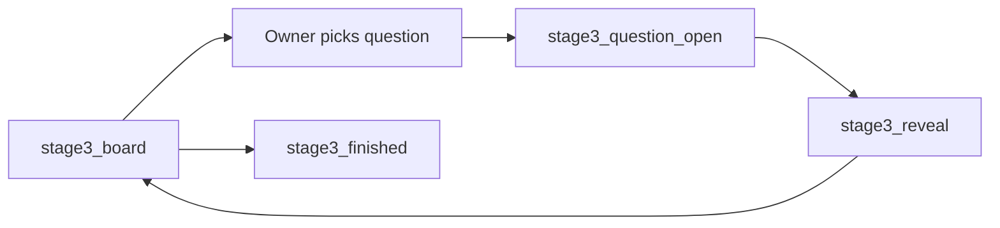
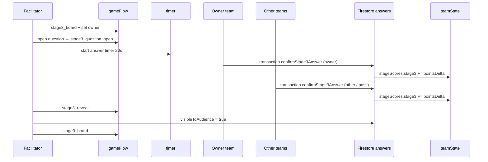

# Stage 3 Answer Architecture — على المحك (Sprint 4.3.1)

> **Document type:** Canonical blueprint for Sprint 4.4 answer engine — **no live code changes**  
> **Stage name:** **على المحك**  
> **Date:** 2026-06-03  
> **Builds on:** Sprint 4.1 Foundation · Sprint 4.2 Board · Sprint 4.3 Question Open

---

## Purpose

Define the **Stage 3 answer engine logic** and **Firestore structure** for **على المحك**:

- Owner team selects question → answers → other teams answer (or pass) → reveal → scoring → return to board.

This document is the **single blueprint for Sprint 4.4 coding**. It does not modify Stage 1, Stage 2, auth, or routing.

**Authoritative rules:** `docs/stage3-official-rules.md`  
**Current implementation state:** `docs/stage3-question-open-foundation.md`

---

## 1. Lifecycle overview

Official segment per question event:

```
stage3_board
  → (owner selects field + question; selection timer 15 s)
  → stage3_question_open
  → (answer timer 20 s; owner must answer; others may answer or pass)
  → stage3_reveal
  → (reveal timer 10 s; facilitator preview; audience gradual reveal)
  → stage3_board
  → … repeat …
  → stage3_finished
```



**Sprint 4.3 already implements:** board UI, facilitator cell selection, `فتح السؤال` → `stage3_question_open`, temporary `gameFlow.stage3ActiveQuestion` / `stage3OpenedQuestionIds`.

**Sprint 4.4 adds:** answer UI, transactions, scoring, timers, reveal gating, turn owner, pass flow.

---

## 2. Firestore answer documents

### 2.1 Path pattern

```
competitions/main/answers/stage3_{questionId}_{teamId}
```

| Segment | Example | Notes |
|---------|---------|-------|
| `questionId` | `characters_q1` | Board cell id from `Stage3QuestionMetadata.id` |
| `teamId` | Firebase Auth UID | One doc per team per question event |

**One document per team per question.** Owner and other teams never share a document.

Aligns with Stage 1 pattern (`stage1_{questionId}_{teamId}`) and Stage 2 field answers.

### 2.2 Document schema

| Field | Type | Required | Description |
|-------|------|----------|-------------|
| `teamId` | string | ✓ | Firebase UID of the answering team |
| `teamName` | string | ✓ | Denormalized from `teams/{teamId}` |
| `stage` | string | ✓ | Always `"stage3"` |
| `questionId` | string | ✓ | Board question id (e.g. `miracles_q3`) |
| `fieldId` | string | ✓ | Field key (e.g. `miracles`) |
| `difficulty` | string | ✓ | `"easy"` \| `"medium"` \| `"hard"` |
| `isOwner` | boolean | ✓ | `true` if this team is turn owner for this question |
| `answer` | string | ✓ | Selected answer text (or pass token — see §4) |
| `passed` | boolean | optional | `true` if other team explicitly passed (تجاوز); owner cannot pass |
| `confirmed` | boolean | ✓ | `true` after confirm step |
| `confirmedAt` | timestamp | ✓ | Server timestamp at confirm |
| `isCorrect` | boolean | ✓ | Evaluated against question bank |
| `pointsDelta` | number | ✓ | Applied delta (+/−/0); stored for audit |
| `visibleToAudience` | boolean | optional | `false` until reveal; align with master doc §19 |
| `createdAt` | timestamp | ✓ | Document creation |
| `updatedAt` | timestamp | ✓ | Last update |

**Stage 1/2 parity fields:** `stage`, `isCorrect`, `visibleToAudience` mirror frozen patterns where applicable.

### 2.3 Duplicate prevention

Follow Stage 1/2 transaction guard:

```text
IF answer doc exists AND confirmed === true
  → return duplicate result (no score change)
ELSE IF guards pass (status, timer, role)
  → write answer doc + update teamState scores in same transaction
```

Never overwrite a confirmed answer. Never apply `pointsDelta` twice.

---

## 3. Team roles and answer flow

### 3.1 Turn owner (صاحب الدور)

| Rule | Behavior |
|------|----------|
| Selection | Picks field + question on `stage3_board` (future: owner team UI; Sprint 4.3: facilitator-driven) |
| Must answer | Cannot pass; no answer before timer end → treated as wrong/no answer (−penalty) |
| One submission | One confirmed answer per question per owner team |
| When | Only while `gameFlow.status === "stage3_question_open"` and answer timer active |

**Transaction (owner):**

1. Read `gameFlow`, `timer`, existing answer doc, `teamState`.
2. Assert `status === "stage3_question_open"`.
3. Assert `isOwner === true` for authenticated team (from `gameFlow.stage3OwnerTeamId` — proposed §6).
4. Assert answer timer not expired.
5. Assert answer doc not already `confirmed`.
6. Evaluate correctness → compute `pointsDelta` from difficulty + owner row (§5).
7. Write answer doc; update `stageScores.stage3`, `totalScore`; optional mirror `progress.stage3SelectedQuestionId`.

### 3.2 Other teams (باقي الفرق)

| Rule | Behavior |
|------|----------|
| May answer or pass | Pass = no answer / تجاوز → **0 points** (not a penalty) |
| Wrong answer | Negative penalty per difficulty row |
| One submission | One confirmed answer (or pass record) per team per question |
| When | Same window as owner: `stage3_question_open` + answer timer |

**Transaction (other team):**

Same guard pattern as owner, with `isOwner === false` and scoring from other-team row.

**Pass handling (proposed):**

- Write answer doc with `passed: true`, `answer: ""`, `isCorrect: false`, `pointsDelta: 0`, `confirmed: true`.
- Or skip document entirely and treat absence at reveal as 0 — **recommend explicit pass doc** for facilitator audit trail.

### 3.3 Facilitator preview

Per official rules: facilitator sees answers **before** audience during `stage3_question_open` / pre-reveal.

- Team/audience: hide other teams’ answers until `stage3_reveal` (`visibleToAudience: false`).
- Facilitator panel: subscribe to all answer docs for active `questionId`.

### 3.4 Separation of documents

| Team type | Document id example |
|-----------|---------------------|
| Owner | `stage3_characters_q1_{ownerTeamId}` |
| Other A | `stage3_characters_q1_{teamAId}` |
| Other B | `stage3_characters_q1_{teamBId}` |

Each transaction is independent; duplicate prevention is **per document**.

---

## 4. UI flow (two-step confirm)

Mirror Stage 1/2 frozen pattern (master doc §19):

1. **Select** — team chooses option (or pass for non-owner).
2. **Confirm** — separate confirm action; no edit after confirm.

**Expired timer message (Arabic):**

> انتهى وقت الإجابة، بانتظار توجيه الميسر

Show when `stage3_question_open` but timer expired or submission rejected.

**Owner:** no pass button.  
**Others:** optional **تجاوز** button → pass transaction (0 points).

---

## 5. Scoring model

Source: `docs/stage3-official-rules.md` §7 (user-confirmed competition plan).

### 5.1 Points table

| Role | Difficulty | Correct | Wrong | No answer / pass |
|------|------------|---------|-------|------------------|
| **Owner** | Easy | +15 | −5 | −5 |
| **Owner** | Medium | +30 | −10 | −10 |
| **Owner** | Hard | +45 | −15 | −15 |
| **Other** | Easy | +5 | −5 | **0** |
| **Other** | Medium | +10 | −10 | **0** |
| **Other** | Hard | +15 | −15 | **0** |

### 5.2 Application rules

| Rule | Implementation |
|------|----------------|
| Duplicate confirm | `pointsDelta` not applied again |
| Late submit | Reject transaction if timer expired |
| Score fields | `teamState.stageScores.stage3 += pointsDelta`; `totalScore += pointsDelta` |
| No double-count | Single transaction writes answer + scores |
| Negative totals | Allowed (official negative scoring) |

### 5.3 Scoring function (proposed module)

```
features/stage3/stage3-scoring.ts

computeStage3PointsDelta(
  isOwner: boolean,
  difficulty: Stage3Difficulty,
  outcome: "correct" | "wrong" | "no_answer" | "pass"
): number
```

Difficulty comes from `stage3ActiveQuestion.difficulty` at open time.

---

## 6. Timer and guards

### 6.1 Central timer (extend existing `competitions/main/timer`)

| Phase | `gameFlow.status` | `timer.stage` | `timer.purpose` | Duration |
|-------|-------------------|---------------|-----------------|----------|
| Selection | `stage3_board` | `"stage3"` | `"selection"` | 15 s |
| Answer | `stage3_question_open` | `"stage3"` | `"answering"` | 20 s |
| Reveal | `stage3_reveal` | `"stage3"` | `"reveal"` | 10 s |

Extend types (Sprint 4.4):

- `CompetitionTimerStage`: add `"stage3"`
- `TimerPurpose`: add `"selection"` \| `"reveal"` (or reuse `"answering"` only where appropriate)

### 6.2 Transaction guards (checklist)

Every `confirmStage3Answer` transaction must verify:

| Guard | Failure |
|-------|---------|
| Authenticated team | throw |
| `gameFlow.status === "stage3_question_open"` | throw |
| Active question id matches `gameFlow.stage3ActiveQuestion.id` | throw |
| Answer timer active and not expired | throw |
| Answer doc not `confirmed` | return duplicate |
| Owner team rule (owner must not pass) | throw |
| Role match (`isOwner` vs authenticated team) | throw |

Stage 1 reference: `features/stage1/confirm-stage1-answer.ts` (gameFlow + timer + duplicate checks).

### 6.3 Timeout behavior

| Actor | On answer timer expiry |
|-------|------------------------|
| Owner | Treated as no answer → penalty applied at reveal or auto-close (facilitator policy — recommend auto penalty doc at reveal start) |
| Other | No doc → 0 points |
| UI | Disable submit; show Arabic expiry message |

**Open design point for Sprint 4.4:** whether owner no-answer penalty is written automatically at timer end (Cloud Function / facilitator action) or at reveal transition. **Recommend:** facilitator or system batch at transition to `stage3_reveal`.

---

## 7. gameFlow and teamState (Sprint 4.4 extensions)

### 7.1 gameFlow — finalize Sprint 4.3 temporary fields

| Field | Type | Purpose |
|-------|------|---------|
| `stage3ActiveQuestion` | object \| null | Active question metadata (keep from 4.3) |
| `stage3OpenedQuestionIds` | string[] | Cells opened at least once |
| `stage3OwnerTeamId` | string \| null | **New** — turn owner UID |
| `stage3OwnerTeamName` | string \| null | **New** — denormalized display |
| `stage3UsedQuestionIds` | string[] | **New** — scored/completed questions (replaces **مُختار** semantics post-reveal) |

Clear `stage3ActiveQuestion` when returning to `stage3_board`; append `stage3UsedQuestionIds` after reveal completes.

### 7.2 teamState — optional mirrors

| Field | Purpose |
|-------|---------|
| `progress.stage3SelectedQuestionId` | Last/active question id hint (optional UI mirror) |
| `progress.stage3.currentField` | Field key of active question |
| `progress.stage3.questionIndex` | Cell number 1–6 |

Written in same transaction as owner selection open (Sprint 4.4), not required for every other-team answer.

---

## 8. Reveal phase (`stage3_reveal`)

| Responsibility | Detail |
|----------------|--------|
| Transition | Facilitator or timer end → `stage3_reveal` |
| Answer visibility | Set `visibleToAudience: true` on answer docs (batch update or per-doc at reveal) |
| Audience | Gradual reveal of team answers + points (master doc §14) |
| Scores | Already applied at confirm time in Sprint 4.4 design (not at reveal) |
| After reveal | Facilitator returns all screens to `stage3_board` centrally |
| Board UI | Mark question as **used** (not just **مُختار**) via `stage3UsedQuestionIds` |

**Note:** Sprint 4.3 **مُختار** badge ≠ completed. Sprint 4.4+ distinguishes **selected/opened** vs **used/scored**.

---

## 9. Facilitator responsibilities

| Action | Effect |
|--------|--------|
| Start Stage 3 | `stage3_intro` → `stage3_board` |
| Set turn owner | Write `stage3OwnerTeamId` (rotation logic TBD) |
| Open question | Select cell + **فتح السؤال** → `stage3_question_open` + start answer timer |
| Monitor answers | Live table of answer docs for active `questionId` |
| Reveal | `stage3_reveal` + reveal timer |
| Return to board | `stage3_board`; clear active question |
| Finish | `stage3_finished` |

Progress table (`Stage3ProgressTable`) should extend to show: owner, active question, per-team answer status, `stageScores.stage3`.

---

## 10. Proposed Sprint 4.4 module layout

```
features/stage3/
├── stage3-scoring.ts              computeStage3PointsDelta()
├── confirm-stage3-answer.ts       runTransaction (owner + other)
├── use-stage3-active-answers.ts     onSnapshot for current questionId
├── components/
│   ├── stage3-question-open-screen.tsx   (+ answer card, pass, confirm)
│   ├── stage3-answer-card.tsx
│   └── stage3-reveal-screen.tsx          (Sprint 4.4 or 4.5)
└── (existing board / metadata modules)
```

**Do not modify:**

- `features/stage1/*`
- `features/stage2/*`

---

## 11. Data flow diagram



---

## 12. Alignment with existing codebase

| Pattern | Stage 1/2 reference | Stage 3 adaptation |
|---------|---------------------|-------------------|
| Answer path | `answerRef(main, answerId)` | `stage3_{questionId}_{teamId}` |
| Transaction | `confirm-stage1-answer.ts` | `confirm-stage3-answer.ts` |
| Duplicate guard | `confirmed === true` | Same |
| gameFlow guard | `status === "stage1_running"` | `status === "stage3_question_open"` |
| Timer guard | `timer.stage` + `endsAtMs` | `timer.stage === "stage3"` |
| Two-step UI | question card + confirm | Same |
| Scoring | positive only in S1/S2 | **+ and −** in Stage 3 |

---

## 13. Out of scope (Sprint 4.3.1)

- Board UI changes (done in 4.2)
- Question bank / CMS / Excel import
- Actual Firestore writes or React answer UI
- Final scoreboard / Stage 3 ranking UI
- Stage 4 streak scoring
- Cloud Functions (optional future hardening)
- Firestore security rules deployment

---

## 14. Sprint 4.4 acceptance checklist (derived from this doc)

- [ ] Owner confirm writes answer doc + updates `stageScores.stage3` / `totalScore`
- [ ] Other team confirm/pass with correct row from §5.1
- [ ] Duplicate confirm returns without score change
- [ ] Timer + status guards reject late submits
- [ ] Facilitator sees answers before audience
- [ ] Reveal sets audience visibility
- [ ] Return to board marks question used
- [ ] No Stage 1/2 file modifications
- [ ] `npm run typecheck`, `lint`, `build`

---

## 15. References

| Document | Role |
|----------|------|
| `docs/stage3-official-rules.md` | Scoring table, timers, turn rules |
| `docs/stage3-foundation.md` | Statuses, placeholders |
| `docs/stage3-board-foundation.md` | Board mock data |
| `docs/stage3-question-open-foundation.md` | Current gameFlow temp fields |
| `docs/stage2-freeze-v1.md` | Frozen Stage 2 — do not modify |
| `docs/stage1-freeze-v1.md` | Frozen Stage 1 — do not modify |
| `features/stage1/confirm-stage1-answer.ts` | Transaction template |
| `Sufaraa-Al-Maseeh-Master-Documentation-v1.pdf` §10, §14, §19 | Official product rules |

---

**Status:** Architecture approved for Sprint 4.4 implementation. **No production code changes in Sprint 4.3.1.**
